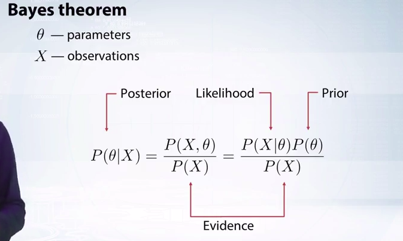
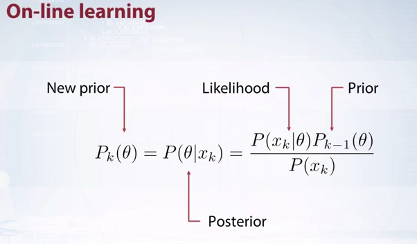
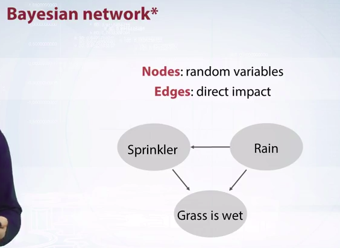
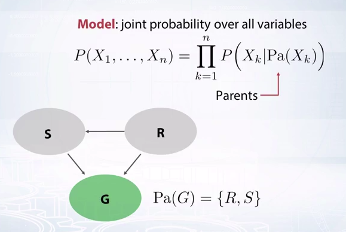
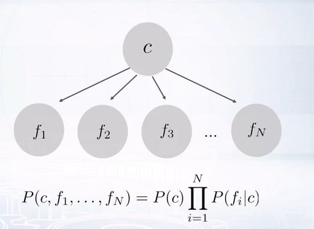
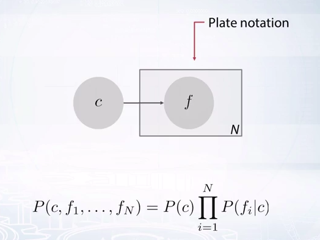

Bayesian Method in Machine Learning - Week1
===============================

# 1. Introduction to Bayesian methods

## 1.1. Think bayesian & Statistics review

* 3 nguyên tắc áp dụng trong khóa học
    * Sử dụng tri thức *trước*
    * Chọn câu trả lời giải thích được các quan sát một cách tốt nhất
    * Tránh việc đưa ra thêm các giả sử

* Ôn tập kiến thức xác suất cơ bản
    * Biến ngẫu nhiên
        * Biến rời rạc (Discrete random variable)
            * Hàm Probability Mass Function (PMF): cho biết xác suất của biến ngẫu nhiên X khi biết giá trị X
        * Biến liên tục (Continous random variable):
            * Hàm Probability Density Function (PDF): cho biết mật độ xác suất
    * Hai biến ngẫu nhiên độc lập: P(X,Y) = P(X)P(Y). P(X,Y) gọi là xác suất đồng thời của X và Y (joint probability)
    * Xác suất có điều kiện (conditional probability): P(X|Y) = P(X,Y) / P(Y)
    * Hai luật phổ biến
        * Chain rule: P(X,Y) = P(X|Y)P(Y)
        * Sum rule: $P(X) = \int_{-\infty}^{+\infty} P(X,Y) dY$ (Xác suất này còn gọi là xác suất biên - Marginalization Probability)
    * Định lý Bayes và tên các xác suất
     

## 1.2. Bayesian approach to statistics
* Có 2 cách tiếp cận trong thống kê là Frequentist và Bayesian

Tiêu chí so sánh | Frequentist | Bayesian
---------|-------------|------------
Cách đối xử với Data (X) và Parameter (theta)| X là random, theta là cố định| X là cố định và theta là random
Trường hợp sử dụng|Thường dùng khi dữ liệu đủ lớn (\|X\| >> \|theta\|)|Có thể dùng khi dữ liệu nhỏ, có thành phần prior (xem như *regularizer*) giúp hạn chế overfitting
Quá trình training|Tìm theta để **Maximum Likelihood Estimation (MLE)**| Tìm theta để **Maximum a Posterior (MAP)** nhờ định lý Bayes

* Bayesian
    * Regularizer: P(theta) được xem như regularizer. Xác suất này phản ánh tri thức về phân bố của theta mà ta có thể biết trước mà không cần thông qua dữ liệu đang xét (VD khi xét việc tung n lần 1 đồng xu thì tri thức ta đã biết truớc là xác suất tung ra mặt ngửa trong 1 lần là dao động quanh 0.5). Sự ràng buộc gắn xác suất của dữ liệu hiện tại với tri thức đã biết sẽ giúp hạn chế overfitting khi dữ liệu quá nhỏ. Nếu tri thức prior này sát với thực tế hiện tại thì model càng cho kết quả tốt
    * Online learning: Khi mỗi lần train ta chỉ có 1 tập dữ liệu, sau đó các tập dữ liệu mới đến dần theo thời gian. Ta sẽ cập nhật *tri thức* P(theta) dựa trên quá khứ
     

## 1.3. How to define a model

* Để định nghĩa Bayesian model ta dùng 1 đồ thị có hướng (chú ý là đồ thị này **khác** với khái niệm **Bayesian neural network**

    * Node là biến ngẫu nhiên
    * Cạnh có hướng chỉ quan hệ ảnh hưởng. VD nếu trời mưa thì cỏ sẽ ướt và vòi phun nước sẽ không hoạt động
* Công thức định nghĩa cho 1 mô hình xác suất từ Bayesian Network

* Xét mô hình Naive Bayes Classifier

    * Mỗi giá trị của biến ngẫu nhiên c (các class/label) sẽ có feature vector khác nhau (có sự ảnh hưởng)
    * Cách vẽ này cồng kềnh, lặp lại. Do đó ta sử dụng plate notation
     

## 1.4. Example: thief & alarm
* Bài toán giúp ôn tập lại xác suất. Đến đoạn cuối video có chút *bất ngờ thú vị*!!
* Phát biểu bài toán:
 
    * Mua thiết bị báo động chống trộm vào nhà
    * Nếu trộm vào nhà thì thiết bị sẽ báo động (có thể gửi SMS cho chủ nhà)
    * Nếu có động đất thì thiết bị sẽ báo động sai
    * Nếu có động đất *mạnh* thì đài sẽ thông báo và chủ nhà sẽ biết thông tin này

## 1.5. Linear regression
* Tiếp cận bài toán theo góc nhìn của Bayesian
* Sau khi đưa ra hàm cần tối ưu ta thấy giống với hàm mục tiêu tìm được theo cách minimize mean square error. Ngoài ra, phần Regularization xuất hiện nhờ việc đưa xác suất trước P(theta) vào.

## 1.6. MLE estimation of Gaussian mean
* Ví dụ minh họa cách dùng MLE để tìm mean của 1 phân bố Gaussian (Normal Distribution)

## Tài liệu tham khảo

### 1. [Bayesian Methods for Machine Learning - Week1](https://www.coursera.org/learn/bayesian-methods-in-machine-learning/home/week/1) 